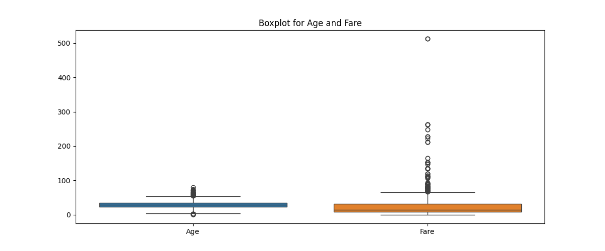

# 🚢 Titanic Dataset - Data Preprocessing (Task 1)

**Author:** Hemasrilakshmi  
**Repository:** [GitHub Repo](https://github.com/Hemasripatkuri4/titanic-data-preprocessing)

---

## 📌 Task Objective

The goal of this task is to clean and prepare the Titanic dataset to make it ready for Machine Learning models. The main steps include:

- Checking for missing values
- Filling or removing null data
- Encoding text data into numbers
- Normalizing data
- Identifying and removing outliers

---

## 📁 Files in This Repo

| File Name              | Purpose                                            |
|------------------------|----------------------------------------------------|
| `Titanic-Dataset.csv`  | Original dataset containing passenger details      |
| `titanic_preprocessing.py` | Python script to preprocess the dataset             |
| `processed_titanic.csv`| Final cleaned dataset after processing             |
| `boxplot_outliers.png` | Boxplot chart to visualize outliers                |
| `README.md`            | This explanation file                              |

---

## 🛠 Tools Used

- Python  
- Pandas  
- NumPy  
- Seaborn  
- Matplotlib  
- sklearn (for standard scaling)

---

## ✅ Steps Followed

1. **Load the data**  
   Loaded the CSV file and displayed basic information.

2. **Missing Value Handling**  
   - Filled missing `Age` values using the median.  
   - Filled missing `Embarked` values using the mode.  
   - Dropped `Cabin` column because it had too many missing entries.

3. **Categorical Data Handling**  
   - Converted `Sex` to 0 and 1 (Label Encoding).  
   - One-hot encoded the `Embarked` column.

4. **Normalization**  
   - Standardized the `Age` and `Fare` columns.

5. **Outlier Detection**  
   - Plotted boxplots for `Age` and `Fare`.  
   - Saved the image as `boxplot_outliers.png`.

---

## 📷 Output Example

> 

---

## 📦 Result

The cleaned dataset is saved as `processed_titanic.csv` and is ready for machine learning use.

---

## 🔗 Shareable Repo Link

**[Click to view GitHub Repository](https://github.com/sudhatanmai/titanic-data-preprocessing)**

